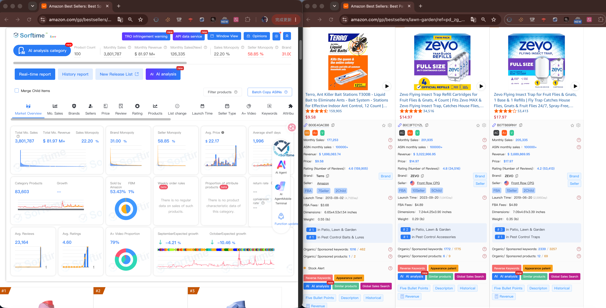

# Sorftime Seller Agent — Free AI-Powered Amazon Product Research & Marketplace Intelligence

<p align="center">
  
</p>
<p align="center"><em>9 years of seller data · 40+ global marketplaces · 160+ data dimensions · Backed by Sorftime's AI data supply chain</em></p>

<p align="center">
  
</p>

> **AI-powered product research, competitor analysis, and keyword intelligence for Amazon, Walmart, TikTok Shop, Shopee, TEMU, and 1688 sellers.**
>
> Open source. Free trial. Works with any MCP-compatible AI agent — Claude Code, Codex, Cursor, OpenClaw, and more.
>
> **Stop clicking through dashboards. Just talk to your AI.**

[](LICENSE)
[](https://python.org)
[]()
[]()
[]()
[]()

---

## 🆕 What's New (July 30, 2026)

- **📚 Wiki now live** — [Exclusive Methodology](https://github.com/DannylydST/sorftime-seller-agent/wiki/Exclusive-Methodology): Hidden Profit Index, Low Price Index. [25 Sourcing Strategies](https://github.com/DannylydST/sorftime-seller-agent/wiki/Sourcing-Methodology): complete playbook across Market × Product × Keyword dimensions. Fully cross-linked with platform guides and glossary.
- **1688 factory sourcing** — full toolchain verified. Multi-dimension supplier filtering, SKU breakdown, reverse image search.
- **Shopee cross-border feasibility** — compare local vs cross-border seller density. Cohort analysis (new product survival rate). Keyword favorites management.
- **Amazon + Walmart audit complete** — 21 additional tools verified. Product reviews, traffic terms, competitor keywords, variations all confirmed.
- **Cross-platform command templates** — platform selection, price arbitrage, product migration workflows.
- **[Full changelog →](CHANGELOG.md)**

---

## ⚡ Quick Start

### 1. Create a free account
[open-intl.sorftime.com](https://open-intl.sorftime.com) — sign up with **Google**, free trial credits included. PayPal for additional credits.

### 2. Install
```bash
git clone https://github.com/DannylydST/sorftime-seller-agent.git
cd sorftime-seller-agent
python3 scripts/install.py
```

### 3. Ask your AI
```
"Find blue ocean products in yoga mats on Amazon US for a beginner"
"Analyze this Amazon competitor: ASIN B08N5WRWNW — traffic keywords, pricing, sales trend"
"Calculate my Amazon FBA profit: price $29.99, cost $8.50, weight 1.2lb"
"Pull Shopee MY phone case category Top 20 — who's selling, what prices, brand share"
"Compare this product's price between Walmart and Amazon"
```

---

## 👤 Who Is This For

| If you are a… | You can… |
|---|---|
| **Amazon FBA seller** | Product discovery, competitor reverse-ASIN, keyword research, profit calculator, listing audit, review mining |
| **Walmart marketplace seller** | Category scanning, keyword ranking, product trend tracking, cross-platform price gap analysis (Walmart vs Amazon) |
| **Shopee / TikTok Shop / TEMU seller** | Category research, market analysis, product trend monitoring, shop competitor intelligence |
| **Dropshipper / arbitrage seller** | Cross-platform price comparison, 1688 factory sourcing, multi-marketplace opportunity scanning |
| **E-commerce agency / VA** | Batch competitor analysis, keyword library building, automated monitoring for clients |

---

## 🧠 What You Can Do

|     | Use Case | Example Prompt |
|-----|----------|---------------|
| 🔍 | **Amazon Product Research** | "Find blue ocean kitchen products under $30 on Amazon US for a beginner seller" |
| 💎 | **Hidden Profit Index** ⭐ (独家) | "Scan the yoga mat category — surface products with high hidden profit potential that other tools miss" |
| 🎯 | **Competitor Analysis (Reverse ASIN)** | "Break down ASIN B08N5WRWNW — monthly sales, traffic keywords, pricing history, FBA fees" |
| 🔑 | **Amazon Keyword Research** | "What are the best long-tail keywords for yoga mats? Show search volume and competition" |
| 💰 | **Amazon FBA Profit Calculator** | "Calculate FBA profit: $29.99 selling price, $8.50 unit cost, 1.2lb weight" |
| 📊 | **Market & Category Analysis** | "Analyze the blender category on Amazon US — brand monopoly, pricing trends, market gaps" |
| 🏪 | **Shopee Market Research** | "Pull Shopee MY phone case category Top 20 — brands, pricing bands, shop types, sales distribution" |
| 🛒 | **Walmart Product Research** | "Find blue ocean products on Walmart US under $25 with low review counts" |
| 🎬 | **TikTok Shop Intelligence** | "Show me top-selling TikTok Shop US beauty products and their video authors" |
| 📈 | **Automated Price & Sales Monitoring** | "Watch ASIN B08N5WRWNW and alert me when price drops below $15 or sales spike 50%" |
| 🌏 | **Cross-Platform Arbitrage** | "Find products priced 30%+ higher on Walmart than Amazon US — low competition on Walmart side" |

---

## 🤔 Why This Exists

Amazon sellers spend **$29–$229/month** on marketplace research tools. You log into dashboards, click through menus, export CSV files, then manually analyze in spreadsheets.

**Sorftime Seller Agent replaces that workflow with conversation.** Talk to your AI assistant — any MCP-compatible agent — and it queries marketplace data directly, analyzes it with 20 proprietary methodology frameworks, and returns actionable insights in seconds.

```
Before: Log in → navigate → click → export → analyze manually  (15–30 min)
After:  "Find blue ocean yoga mat products on Amazon US" → results in 20 seconds
```

---

## 🆚 How It Compares

| | Traditional Seller Tools | **Sorftime Seller Agent** |
|---|-------------------------|--------------------------|
| **Interface** | GUI dashboards | **AI conversation (natural language)** |
| **Platforms** | Amazon only (typical) | **6 platforms** — Amazon, Walmart, TikTok Shop, Shopee, TEMU, 1688 |
| **Data depth** | Basic product metrics | **160+ dimensions + 20 proprietary indices** including Hidden Profit Index ⭐ (独家), Blue Ocean Finder, and 17+ methodology cards |
| **AI integration** | None — manual operation | **MCP-native** — any AI agent can query and analyze |
| **Works with** | Browser only | **Claude Code · Codex · Cursor · OpenClaw · Hermes · Pi · any MCP agent** |
| **Automation** | Manual workflows | **Agent auto-execution** — scheduled monitoring, batch analysis |
| **Pricing** | $29–$229/month | **Free trial + usage-based paid tiers** |
| **Setup** | 20+ minutes | **Under 3 minutes** |
| **Open source** | Closed source | **MIT license** — inspect, modify, contribute |

---

## 🤖 Agent-Friendly by Design

<p align="center">
  
</p>

**Not a Claude Code plugin. Not an API wrapper.** A self-contained MCP bridge + intelligence layer that any MCP-compatible AI agent can load and use immediately.

| Agent / IDE | Setup |
|-------------|-------|
| **Claude Code** | Auto-detected by `mcporter`, one-command install — under 3 min |
| **Codex (OpenAI)** | Import as MCP server — under 5 min |
| **Cursor** | MCP config auto-generated by `install.py` — under 3 min |
| **OpenClaw** | Native skill directory support — under 3 min |
| **Hermes / Pi / any MCP agent** | Standard `tools/list` → `tools/call` protocol — under 5 min |

**What makes it agent-agnostic:**

- **MCP-first architecture** — 86 tools, auto-synced with Sorftime server. Pure MCP protocol.
- **Zero agent-specific code** — No Claude-only prompts. No Cursor-only config.
- **Auto-detection** — `install.py` detects your environment and outputs the right config snippet.
- **Self-contained** — Ships with its own Python venv, bridge, cache, and schema store. Python 3.10+ is the only dependency.
- **Bilingual** — English and Chinese input, auto-routed to the right analysis pipeline.

---

## 💬 Example Conversations

### Hidden Profit Index (Sorftime exclusive ⭐)
> **You**: "Scan the yoga mat category on Amazon US — find products with high hidden profit potential."
>
> **Agent**: *[potential_product + composite ranking]*
> "Sorftime's Hidden Profit Index ranks products by a composite of low entry barriers, low ad spend competitiveness, and healthy margins. Top find: a non-slip mat with $29.99 price, 4.6 stars, only 13 reviews but 106 units/month — HPI 13.44. Low ad spend index, low review barrier. Products like this get filtered out by traditional tools' minimum-review thresholds."

### Amazon product discovery (blue ocean)
> **You**: "Find blue ocean products in kitchen storage on Amazon US. Beginner seller, $5K budget."
>
> **Agent**: *[category scan + competition filter]*
> "5 opportunities with low brand concentration, <500 reviews on top listings, healthy margins. #1: Under-sink organizers — 15K monthly searches, only 3 competitors with >100 reviews, estimated margin 35–42%."

### Amazon competitor deep-dive (reverse ASIN)
> **You**: "Reverse ASIN B08N5WRWNW — traffic keywords, pricing strategy, sales trend."
>
> **Agent**: *[ProductDetail + TrafficTerms + CompetitorKeywords]*
> "Gaiam Yoga Block — 40K monthly sales, 4.7 stars, $18.99. Top traffic keywords: 'yoga block' (52K), 'yoga blocks 2 pack' (28K), 'cork yoga block' (15K). FBA fee: $12.82. Top competitor ASINs: B07XJ5YV8G, B09XMQ5J8W."

### Amazon FBA profitability
> **You**: "Sourcing yoga mats at $8.50. Selling at $29.99, 1.2lb. Worth it on Amazon FBA?"
>
> **Agent**: *[FBA fee estimation + profit calculation]*
> "Gross margin: 38%. Break-even: 9 units/day. Return rate sensitivity: profit stays positive up to 12% returns. Verdict: viable — proceed."

### Amazon keyword research
> **You**: "Keyword strategy for a new yoga mat listing on Amazon US."
>
> **Agent**: *[KeywordDetail + KeywordExtends + KeywordSearchResults]*
> "Top opportunities: 'extra thick yoga mat' (147K searches, low competition), 'non slip yoga mat' (98K), 'yoga mat with strap' (52K). Avoid 'yoga mat' (1.4M, saturated — Amazon Basics + Gaiam dominate)."

### Shopee category market analysis
> **You**: "Shopee Malaysia phone case market — Top 20 products, pricing bands, shop types."
>
> **Agent**: *[shopee_category_request]*
> "20 products, RM2.38–RM102.37. Ugreen Flagship Store leads with 3.5K monthly sales at RM13.90. 13 brands, all regular shops (no flagship in Top 20). 9/20 products under RM5 — low-end dominates."

### Cross-platform arbitrage (Walmart vs Amazon)
> **You**: "Find products selling 30%+ higher on Walmart than Amazon US."
>
> **Agent**: *[Cross-platform gap scan]*
> "3 products with significant gaps. 'Premium Yoga Block Set' — $34.99 Walmart vs $24.99 Amazon (40% premium). Only 3 Walmart sellers vs 12 on Amazon — low competition entry point."

---

## 🌍 Supported Marketplaces

| Platform | Data Available | Sites |
|----------|---------------|-------|
| **Amazon** | Products · Keywords · Categories · Reviews · Traffic · Trends · FBA Profit | 14 sites (US, GB, DE, FR, IT, ES, JP, CA, MX, AU, IN, AE, SA, BR) |
| **Walmart** | Products · Keywords · Categories · Traffic · Trends · Variations | US |
| **TikTok Shop** | Products · Categories · Authors · Videos · Trends | 8 sites (US, GB, ID, JP, MY, PH, TH, VN) |
| **Shopee** | Products · Keywords · Categories · Shops · Trends · Shop Intelligence | 8 sites (MY, PH, VN, TH, ID, SG, TW, BR) |
| **TEMU** | Products · Categories · Shops · Trends | US, EU |
| **1688** | Products · Variations · Similar items | CN |

---

## 📦 Installation

**Prerequisites**: Python 3.10+ · [Free Sorftime account](https://open-intl.sorftime.com) · Any MCP-compatible AI agent

```bash
git clone https://github.com/DannylydST/sorftime-seller-agent.git
cd sorftime-seller-agent
python3 scripts/install.py     # One-click: venv, deps, MCP config
python3 scripts/healthcheck.py # Verify
```

**Platforms**: macOS · Linux · Windows (Python 3.10+)

---

## 🙋 FAQ

**Q: Is this official Sorftime?**
Yes. Built by [@DannylydST](https://github.com/DannylydST) at Sorftime Data Technology. Connects to Sorftime's official MCP API at [open-intl.sorftime.com](https://open-intl.sorftime.com).

**Q: Is it really free?**
New accounts get **free trial credits** — no credit card required. Paid usage-based tiers available via PayPal for higher-volume sellers and agencies.

**Q: Which AI agents can I use?**
Any MCP-compatible agent: **Claude Code, Codex (OpenAI), Cursor, OpenClaw, Hermes, Pi**, and more. `install.py` auto-detects your environment.

**Q: Where do I get my MCP Key?**
[open-intl.sorftime.com](https://open-intl.sorftime.com) → sign up with Google → MCP page → copy your Key.

**Q: Can I use this without an AI?**
Yes — all CLI tools work standalone: `python3 scripts/picker.py --keyword "yoga mat"`. But AI-driven analysis with the 20 methodology cards unlocks the full value.

**Q: What methodology cards are included?**
**Hidden Profit Index, Blue Ocean Finder, Competitor Deep-Dive, Keyword Strategy, Cross-Platform Price Gap**, and 15 more. Full-ranking models — no hard thresholds that hide borderline opportunities. See `references/methodology-cards/`.

**Q: Does this work for non-US Amazon marketplaces?**
Yes — all 14 Amazon sites: US, GB, DE, FR, IT, ES, JP, CA, MX, AU, IN, AE, SA, BR. Plus Walmart US, 8 Shopee regions, 8 TikTok regions, TEMU US/EU, and 1688 CN.

---

## 📖 Documentation

- **[Wiki](https://github.com/DannylydST/sorftime-seller-agent/wiki)** — Platform guides, methodology cards, troubleshooting, glossary
- **[SKILL.md](SKILL.md)** — Full skill reference: tools, parameters, gotchas
- **[CHANGELOG.md](CHANGELOG.md)** — Version history
- **[CONTRIBUTING.md](CONTRIBUTING.md)** — How to contribute
- **[SUPPORT.md](SUPPORT.md)** — Getting help

---

## 📄 License

MIT © [DannylydST](https://github.com/DannylydST) · Sorftime Data Technology

---

*Built for sellers. By sellers. On 6 platforms.*
