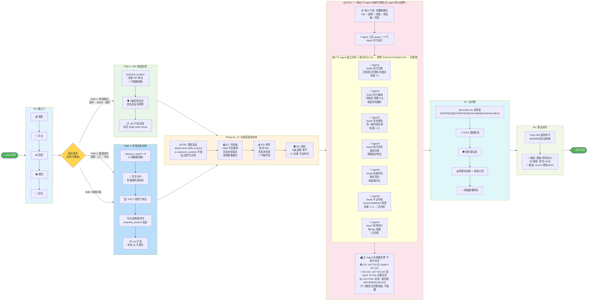

# Sorftime 闭环自动选品工作流 v3.3



---

## 路径选择决策

```
/$10K 新手/套利/转FBA → Path 1 (HPI 单品狙击)
品牌/工厂/专业/20+SKU → Path 2 (市场全景)
进阶 $10-20K → 两者皆可, 选 "Both" 全覆盖
不确定 → Path 2 先找赛道 → Path 1 在赛道内挖宝
```

## 7 人评审团投票规则

| 判决 | 条件 |
|------|------|
| 🟢 **GO** | ≥4/7 GO 且 Seat6 (平台专家) ≠ NO-GO |
| 🔴 **NO-GO** | ≥4/7 NO-GO 或 Seat7 (财务审计) 以 P&L 证据否决 |
| 🟡 **CAUTION** | 其他所有情况 |

## 关键避坑

- `product_traffic_terms`: 读 `exposure_position` 字段, 不查不存在的 `organic_searched_percentage`
- `product_trend`: 参数名是 `product_trend_type` 不是 `trend_type`
- PD2 评审团必须实际 spawn 7 个子 Agent, 主 Agent 禁止自己投票
- PG 必须输出完整 `/loop` 命令 (不是 `/goal`)
- 所有数据标注: [VERIFIED] / [ESTIMATED:公式] / [ASSUMED:来源] / [UNAVAILABLE:原因]

---

*Workflow Design v3.3 | Acceptance Criteria v3.0 | 2026-08-04*
