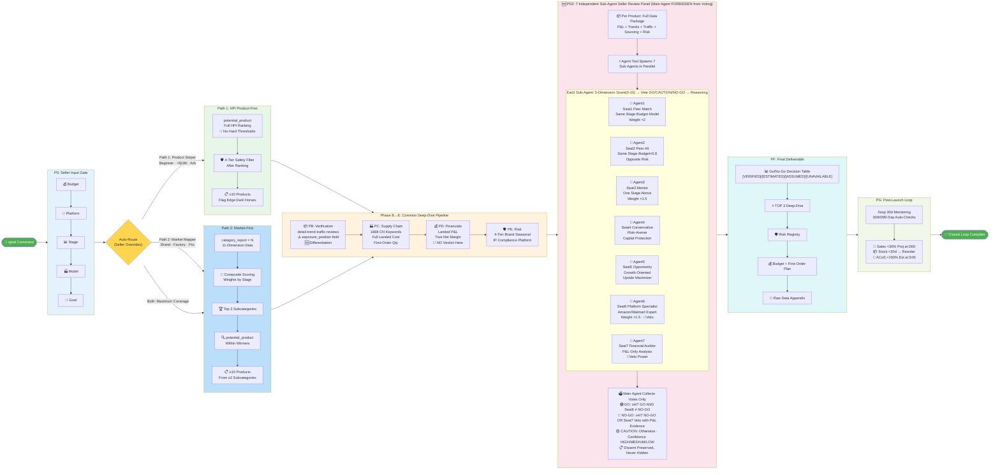

# Sorftime Closed-Loop Product Selection Workflow v3.3



---

## Path Selection Logic

```
Budget <$10K / Beginner / Arbitrage / Dropship→FBA → Path 1 (HPI Product Sniper)
Brand / Factory / Pro / 20+ SKU Portfolio       → Path 2 (Market Mapper)
Growing $10-20K                                  → Either, "Both" for full coverage
Unsure                                           → Path 2 first → Path 1 within winners
```

## 7-Member Panel Voting Rules

| Verdict | Condition |
|---------|-----------|
| 🟢 **GO** | ≥4/7 GO AND Seat6 (Platform Specialist) ≠ NO-GO |
| 🔴 **NO-GO** | ≥4/7 NO-GO OR Seat7 (Financial Auditor) veto with P&L evidence |
| 🟡 **CAUTION** | All other cases |

## Critical Gotchas

- `product_traffic_terms`: Read `exposure_position` ("Organic"/"Ad"/"Ad,Organic"), NEVER query non-existent `organic_searched_percentage`
- `product_trend`: Parameter is `product_trend_type`, NOT `trend_type`
- PD2 Panel: Must actually spawn 7 sub-agents. Main agent FORBIDDEN from voting.
- PG: Must output complete `/loop` command (NOT `/goal`)
- All data labeled: [VERIFIED] / [ESTIMATED:formula] / [ASSUMED:source] / [UNAVAILABLE:reason]

---

*Workflow Design v3.3 | Acceptance Criteria v3.0 | Validated: 20 rounds, 82.7% avg adoption | 2026-08-04*
